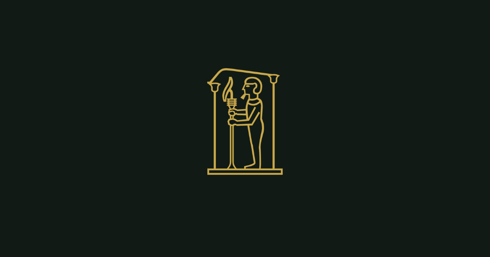

<div align="center">
  
</div>

# The Ptah Protocol

[](LICENSE)
[](lexicons/)
[](https://atproto.com)
[](ROADMAP.md)
[](https://ptah.world)

**Open infrastructure for creative authorship on the AT Protocol.**

The Ptah Protocol is a set of [Lexicon](https://atproto.com/specs/lexicon) schemas for the [AT Protocol](https://atproto.com) network. Fifteen record types that handle attribution, lineage, permissions, and history for creative work — from albums and franchise universes to competitive tournaments and collaborative campaigns. Create a world. Track who contributed what. Trace every sample, adaptation, and remix back to its source. Accumulate history that's permanent and verifiable.

The namespace is `world.ptah.*`. Production schemas are live on the ATProto network.

**Website:** [ptah.world](https://ptah.world) · **Account:** [@ptah.world](https://blacksky.community/profile/ptah.world) · **Contact:** protocol@ptah.world

---

## Quick Start

You need an ATProto account. Find your DID:

```
https://bsky.social/xrpc/com.atproto.identity.resolveHandle?handle=YOUR_HANDLE
```

Declare participation (one record per account, fixed key `self`):

```bash
curl -X POST "https://YOUR_PDS/xrpc/com.atproto.repo.putRecord" \
  -H "Authorization: Bearer YOUR_ACCESS_TOKEN" \
  -H "Content-Type: application/json" \
  -d '{
    "repo": "YOUR_DID",
    "collection": "world.ptah.flax",
    "rkey": "self",
    "record": {
      "$type": "world.ptah.flax",
      "displayName": "Your Builder Name",
      "bio": "World-builder.",
      "createdAt": "2026-01-01T00:00:00Z"
    }
  }'
```

Then create a world, a character, a location, and an action. Full walkthrough in **[GETTING_STARTED.md](GETTING_STARTED.md)**.

---

## Documentation

- **[Getting Started](GETTING_STARTED.md)** — build your first world in five minutes
- **[Specification](SPECIFICATION.md)** — field-level reference for every record type
- **[Examples](examples/)** — four complete world record chains (RENAISSANCE, MCU, Spades, tabletop RPG)
- **[Glossary](GLOSSARY.md)** — terms from protocol infrastructure, world-building, and competitive play
- **[Roadmap](ROADMAP.md)** — where the protocol is and where it's going

---

## Record Types

The protocol defines fifteen record types plus a shared definitions file.

| Record | Namespace | Purpose |
|--------|-----------|---------|
| World | `world.ptah.world` | The foundational record. Everything else references it. Declares name, creator, IP origin, governance, and rendering hints. |
| Character | `world.ptah.character` | A person, creature, or entity inside a world. The character is not the user — it's the world's inhabitant. |
| Template | `world.ptah.template` | A shared identity template. Iron Man is a Template; Tony Stark is a Character instance of it. |
| Action | `world.ptah.action` | The heartbeat of the protocol. Captures who acted, as which character, where, and what happened. |
| Event | `world.ptah.event` | A structured occurrence — competition, gathering, milestone, conflict. Witnesses are verifiable action records. |
| Log | `world.ptah.log` | The world's history book. Traces back to the actions and events that generated it. Attributable and permanent. |
| Origin | `world.ptah.origin` | The attribution and permission layer. Who contributed what, under what terms, with what role. |
| Location | `world.ptah.location` | A place inside a world. Nests infinitely via parent references with a depth index. |
| Collection | `world.ptah.collection` | Bundles multiple works together — album, anthology, season, curated set. |
| Cadence | `world.ptah.cadence` | Temporal orchestration. Controls when and how works surface: schedules, gated access, sequential unlocks. |
| Trace | `world.ptah.trace` | Lineage between works — cover, remix, adaptation, sample, sequel, fork. Includes clearance status. |
| Usage | `world.ptah.usage` | Terms and permissions. What's allowed, where, for how long, and under what conditions. |
| Version | `world.ptah.version` | Edit history within a work. Every version, every change, linked to its predecessor. |
| Flax | `world.ptah.flax` | Participation signal. One per account, fixed key `self`. Used by AppViews for discovery. |
| Defs | `world.ptah.defs` | Shared token definitions referenced across all record types. |

---

## Design Principles

**Attribution is infrastructure, not metadata.** Every record carries a permanent link to its creator. The creator's DID is immutable — it doesn't change even if the record is contributed to, built on, or rendered a thousand different ways.

**The protocol records; clients render.** The schemas define the data. How that data is displayed — which canon tier to show, how to weight narrative significance, what visual style to use — belongs to the rendering layer. Multiple clients can read the same records and produce meaningfully different world experiences.

**Witnessing is presence, not endorsement.** A thousand witnesses do not make an event good. They make it witnessed. The distinction is preserved at every layer.

**The log is rhetoric, not truth.** The protocol makes narrative attributable and permanent. It does not make narrative true. Any log entry can be traced back to its sources, but the interpretation belongs to the author.

---

## Schema Design Decisions

- **`knownValues` over `enum` everywhere.** Fields use open-ended known value sets rather than closed enumerations, allowing extensibility without breaking changes.
- **Consistent required fields.** Core records require a creator DID, a world reference, and a creation timestamp. Most also require a name or title. Everything else is optional.
- **Typed flexible properties.** Freeform metadata uses named object definitions with explicit optional fields rather than untyped key-value pairs.
- **String length limits.** Names: 640 bytes / 64 graphemes. Descriptions: 10,240 bytes / 1,024 graphemes. Log content: 102,400 bytes / 10,000 graphemes.
- **AT URI references throughout.** All cross-record references use the `at-uri` format, making every relationship in the record chain resolvable on the network.

---

## Network Publication

Production schemas are published as `com.atproto.lexicon.schema` records in the [@ptah.world](https://blacksky.community/profile/ptah.world) repository under the `world.ptah.*` namespace. All fifteen schemas are live and resolvable on the ATProto network.

Lexicon resolution is wired via DNS TXT record:
- `_lexicon.ptah.world` → `did=did:plc:l45z35sxxjuobp5q65a5vu22`

DID: `did:plc:l45z35sxxjuobp5q65a5vu22`
PDS: [Blacksky](https://blacksky.app)

---

## Intellectual Property Model

The protocol supports three source types for worlds and their contents:

- **Original IP** — created by the world originator, with full authorship control.
- **Public Domain** — derived from public domain source material, with the Template/Character instance split enabling multiple performances of shared identities.
- **Collaborative Commons** — created under a collaborative framework with shared governance.

The `controlType` field on characters (exclusive, open, contested) and the `instancePolicy` field on templates (open, restricted, closed) govern how creative control flows through the system.

---

## Repository Structure

```
ptah-protocol/
├── README.md
├── SPECIFICATION.md
├── GETTING_STARTED.md
├── CHANGELOG.md
├── CONTRIBUTING.md
├── examples/
│   ├── README.md
│   ├── renaissance.md
│   ├── mcu.md
│   ├── blacksky-spades.md
│   └── shattered-reach.md
├── GLOSSARY.md
├── ROADMAP.md
├── LICENSE
└── lexicons/
    ├── world.ptah.action.json
    ├── world.ptah.cadence.json
    ├── world.ptah.character.json
    ├── world.ptah.collection.json
    ├── world.ptah.defs.json
    ├── world.ptah.event.json
    ├── world.ptah.flax.json
    ├── world.ptah.location.json
    ├── world.ptah.log.json
    ├── world.ptah.origin.json
    ├── world.ptah.template.json
    ├── world.ptah.trace.json
    ├── world.ptah.usage.json
    ├── world.ptah.version.json
    └── world.ptah.world.json
```

---

## Contributing

Contributions are welcome — schema feedback, documentation fixes, example worlds, and tooling. See [CONTRIBUTING.md](CONTRIBUTING.md) for how to get started and what we accept.

---

## License

MIT OR Apache-2.0, at your discretion. Following the dual-license convention used by the AT Protocol reference implementation.

---

## About

The Ptah Protocol is created by [R. Michael Thomas](https://blacksky.community/profile/rmichaelthomas.com).

Named for Ptah, the Egyptian god of craftsmen and architects — the one who conceived the world in his heart and spoke it into existence. The protocol's three-letter hieroglyphic name maps to its architecture: 𓊪 (P) is the foundation layer, 𓏏 (T) is the record layer, 𓉔 (H) is the attribution chain.
